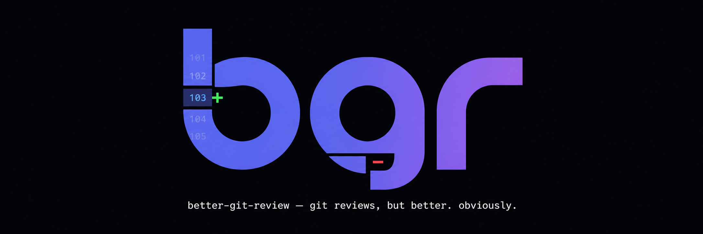
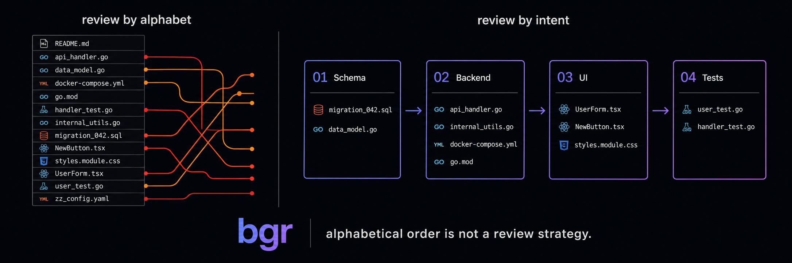
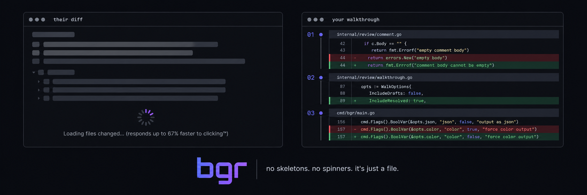

# better-git-review

<p align="center">
  
</p>

`bgr` turns a pull request or unified diff into one guided HTML
walkthrough. Instead of presenting a flat wall of files, it groups related
changes into ordered cohorts, explains the intent of each group, links
dependencies, and renders the complete diff with GitHub-style syntax
highlighting, unified/split views, word-level changes, folding, and blame.
The result is one portable HTML file that opens directly in a browser.

[Open the generated example walkthrough](artifacts/gate-m2-walkthrough.html).

## Why

<p align="center">
  
</p>

<p align="center">
  
</p>

## Install

Download the archive for your platform from
[GitHub Releases](https://github.com/janiorvalle/better-git-review/releases),
extract it, and place `bgr` on your `PATH`. Archives also include the
`better-git-review` long-name alias.

You can also build the latest source with Go 1.24 or newer:

```sh
go install github.com/janiorvalle/better-git-review/cmd/bgr@latest
```

Check the installed version:

```sh
bgr --version
```

## Quickstart

Review the current branch against `main`:

```sh
bgr --base main
```

Review only uncommitted changes, even when the branch also has commits:

```sh
bgr --dirty
```

Review a GitHub pull request using the authenticated `gh` CLI:

```sh
bgr 123
```

Review a patch file or standard input:

```sh
bgr --diff change.patch
git diff main...HEAD | bgr --diff -
```

HTML is the default output. Use `--open` to launch it after generation,
`--out review.html` to choose the path, or `--format json` for the underlying
schema-versioned walkthrough document.

## Providers

With no explicit configuration, providers are detected in this order:
`claude-cli`, `codex-cli`, then `openrouter`.

### Claude CLI

Install and authenticate the `claude` command, then run normally or select it:

```sh
bgr --provider claude-cli --model sonnet --base main
```

The CLI provider runs without tools or session persistence.

### Codex CLI

Install and authenticate the `codex` command:

```sh
bgr --provider codex-cli --base main
```

The provider uses an isolated read-only workspace and disables host, network,
browser, connector, plugin, image, and shell tools. The diff is supplied only
through the prompt.

### OpenRouter

Set an API key and choose a model:

```sh
export OPENROUTER_API_KEY=...
bgr --provider openrouter \
  --model anthropic/claude-sonnet-4.5 \
  --base main
```

OpenRouter uses structured JSON output and defaults to
`https://openrouter.ai/api/v1`.

## Configuration

On macOS and Linux, user configuration lives at:

```text
~/.config/better-git-review/config.toml
```

On Windows it uses `%APPDATA%\better-git-review\config.toml`; state and cache
data use `%LOCALAPPDATA%\better-git-review`. Unix XDG and legacy paths are
unchanged.

Repositories may provide `.better-git-review.toml`. Repository values override
user values, and CLI flags override both.

```toml
provider = "openrouter"

[providers.openrouter]
model = "anthropic/claude-sonnet-4.5"
api_key_env = "OPENROUTER_API_KEY"
base_url = "https://openrouter.ai/api/v1"

[providers.claude-cli]
model = "sonnet"

[providers.codex-cli]
model = "default"
```

Never place an API key itself in configuration. `api_key_env` names the
environment variable containing it.

Provider-related repository configuration is not trusted automatically. On
first use, the requested settings are shown for confirmation and fingerprinted
in the user config directory. Use `--trust-repo-config` or `--yes` in
non-interactive environments.

## Caching, Cost, And Large Diffs

Analysis is cached under the XDG state directory using the diff content,
provider, model, and document schema version. `--no-cache` forces fresh
analysis.

Small diffs use one analysis call. Diffs over the prompt budget use staged
analysis: files are summarized concurrently, then those summaries are
clustered in one final call. The full diffs are always retained in the HTML.
If a file summary fails validation twice, the run continues with a visible
path-derived stub for that file.

Plans over five calls print the provider, model, normal call count, and
worst-case retry ceiling. Interactive runs require confirmation; non-TTY runs
must pass `--yes`.

## Development

See [CONTRIBUTING.md](CONTRIBUTING.md) for setup, tests, and the provider
extension contract.

## License

MIT. See [LICENSE](LICENSE).
